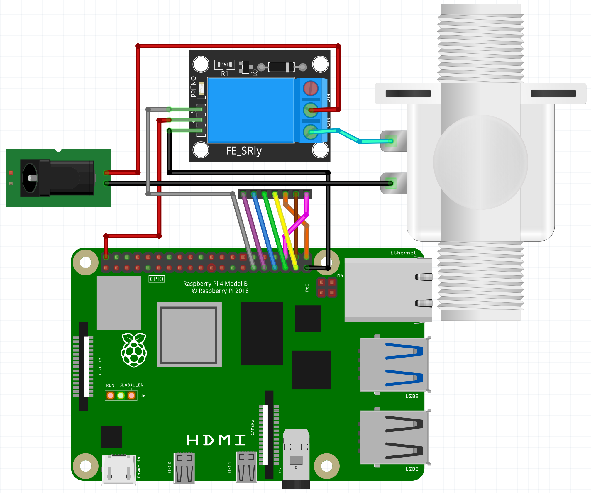

# OpenSprinkler-Schaltplan
Schematics for wiring up a Raspberry Pi 4 with OpenSprinkler using a relais board.

 This schematic displays only one relay and one valve because the others are wired up tdhe same. The digital pins are on the pin headeor with the colorful wires.

Installed in a waterproof case the relais installation looks like this: 
